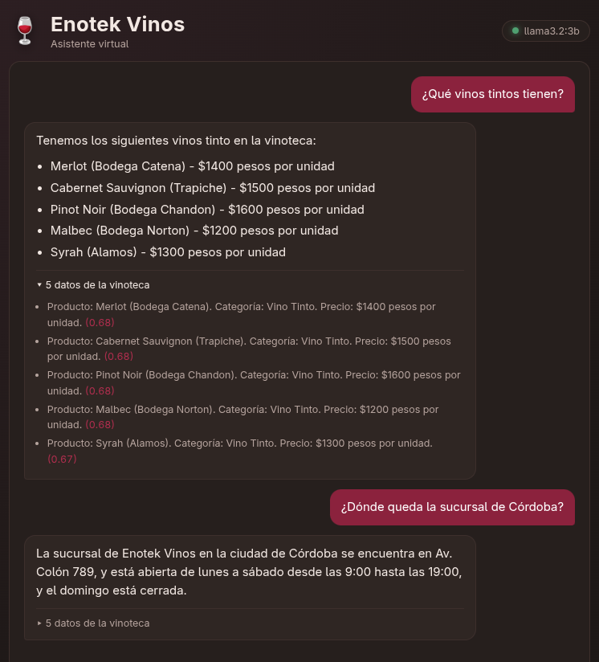
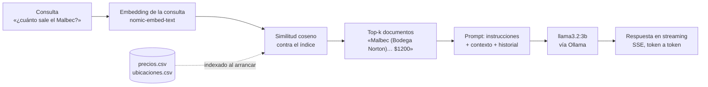

# Enotek Vinos — Asistente con RAG local

[](https://github.com/thejoresp/ChatBot-Vinoteca/actions/workflows/ci.yml)


Asistente conversacional para una vinoteca: responde sobre precios, sucursales y horarios
consultando los datos del negocio, no la memoria del modelo. Corre **enteramente en tu
máquina** — modelo de lenguaje y embeddings vía [Ollama](https://ollama.com), sin API keys
ni servicios de terceros.



---

## Qué resuelve

Un modelo de lenguaje suelto no sabe cuánto sale el Malbec de *esta* vinoteca, y si se lo
preguntás, lo inventa. Este proyecto conecta el modelo a los datos reales del negocio
(dos CSV: 32 productos y 13 sucursales) mediante recuperación semántica, y lo restringe por
prompt a responder sólo con lo que se recuperó.



Cada respuesta viene con las fuentes que la respaldan, desplegables en la interfaz, con su
score de similitud. Si la recuperación no trae nada útil, el asistente lo dice en vez de
improvisar.

---

## Cómo correrlo

### Con Docker (un comando)

```bash
docker compose up
```

Abrí <http://localhost:8000>. La primera vez descarga ~2,3 GB de modelos a un volumen; los
arranques siguientes son inmediatos.

### Sin Docker

Necesitás [Ollama](https://ollama.com/download) instalado y Python 3.11+.

```bash
ollama serve &                      # si no está corriendo ya
ollama pull llama3.2:3b             # ~2 GB
ollama pull nomic-embed-text        # ~275 MB

pip install -e .
uvicorn app.main:app
```

Abrí <http://localhost:8000>. El primer arranque indexa los CSV (unos 30 segundos); después
los embeddings quedan cacheados en `.cache/`.

### Configuración

Todo tiene defaults que funcionan. Para cambiar algo, copiá `.env.example` a `.env`:

| Variable | Default | Para qué |
|---|---|---|
| `OLLAMA_HOST` | `http://127.0.0.1:11434` | Dónde escucha Ollama |
| `CHAT_MODEL` | `llama3.2:3b` | Modelo de chat |
| `EMBEDDING_MODEL` | `nomic-embed-text` | Modelo de embeddings |
| `TEMPERATURE` | `0.2` | Temperatura de generación |
| `TOP_K` | `5` | Documentos que se pasan como contexto |
| `SIMILARITY_THRESHOLD` | `0.55` | Piso de similitud para incluir un documento |
| `MAX_HISTORY_TURNS` | `10` | Turnos que recuerda cada sesión |

---

## API

| Endpoint | Descripción |
|---|---|
| `POST /api/chat` | Consulta en streaming (SSE). Eventos: `session`, `sources`, `token`, `done`, `error` |
| `GET /api/health` | Estado de Ollama, modelos descargados e índice |
| `GET /docs` | OpenAPI interactivo |

```bash
curl -N -X POST http://localhost:8000/api/chat \
  -H "Content-Type: application/json" \
  -d '{"content": "¿Cuánto sale el Malbec?"}'
```

El servidor devuelve un `session_id` en el primer evento; reenviándolo en las consultas
siguientes se mantiene el hilo de la conversación.

---

## Estructura

```
app/
  config.py            Settings con pydantic-settings; todos los paths relativos a la raíz
  prompts.py           Instrucciones del sistema y armado del prompt
  session.py           Historial por sesión, con TTL y recorte por turnos
  models.py            Schemas de request/response
  rag/
    loader.py          CSV → documentos redactados en lenguaje natural
    embeddings.py      Cliente de embeddings de Ollama + cache en disco
    retriever.py       Protocol Retriever + CosineRetriever (numpy)
  llm/ollama_client.py Cliente asíncrono con streaming
  routes/chat.py       Endpoints /api/chat y /api/health
static/                Frontend (HTML + CSS + JS vanilla, sin build step)
data/                  Los CSV del negocio
tests/                 48 tests, sin dependencia de Ollama
```

---

## Decisiones técnicas

**Por qué Ollama y no una API paga.** El proyecto tiene que poder clonarse y correr sin
tarjeta de crédito ni claves. El costo es que hace falta bajar los modelos, y que un modelo
de 3B responde peor que uno grande (ver limitaciones). `OllamaChat` y `OllamaEmbeddings`
están detrás de interfaces chicas, así que agregar un backend de API es un archivo nuevo.

**Por qué no hay vector store.** Son 45 documentos. Chroma o FAISS agregarían una
dependencia pesada para indexar lo que entra en un array de numpy de 45×768; la búsqueda es
un producto matriz-vector. `CosineRetriever` implementa el `Protocol Retriever`, así que si
el catálogo creciera a decenas de miles de filas se reemplaza esa clase sin tocar nada más.

**Por qué los CSV se redactan como oraciones.** Indexar `{"Producto": "Malbec", "Precio": 1200}`
matchea mal contra "¿cuánto sale el malbec?". El loader genera
`"Producto: Malbec (Bodega Norton). Categoría: Vino Tinto. Precio: $1200 pesos por unidad."`,
que es lo que el modelo de embeddings sabe comparar contra una pregunta en lenguaje natural.

**Por qué el umbral de similitud no filtra el off-topic.** Medido sobre este catálogo, las
consultas del dominio puntúan entre 0,62 y 0,79, y las ajenas ("¿cuál es la capital de
Francia?") entre 0,55 y 0,65. Los rangos se superponen: **ningún umbral los separa**.
Presentarlo como un filtro de relevancia sería vender algo que no hace. Lo que hace es
recortar la cola floja de cada búsqueda. Rechazar preguntas fuera de tema es trabajo del
prompt de sistema, que decide con el texto a la vista — y funciona.

**Por qué temperatura 0.2 y no la de fábrica.** La tarea es reproducir datos del catálogo, no
redactar con creatividad. Con el default de Ollama (0.8), el mismo prompt daba respuestas de
calidad muy distinta entre corridas: a veces omitía productos que estaban en el contexto, a
veces negaba una sucursal que sí figuraba. Además volvía imposible evaluar un cambio de prompt,
porque no se podía distinguir la mejora del ruido.

**Por qué los horarios se redactan nombrando apertura y cierre.** El CSV trae
`"Lunes a Sábado: 09:00 a 19:00"`, que deja implícito cuál de los dos números es la apertura.
A "¿a qué hora abren los sábados?" el modelo contestaba "abren hasta las 19:00" — el cierre.
El loader genera `"Abre de lunes a sábado a las 09:00 y cierra a las 19:00."`, y el dato deja
de depender de que el modelo infiera el orden. Si el formato del CSV no matchea, el horario se
pasa tal cual: es preferible un texto menos pulido que uno mal interpretado.

**Por qué SSE y no WebSockets.** El flujo es unidireccional (servidor → cliente) y sobre
HTTP común: SSE alcanza, no necesita otro protocolo y se depura con `curl`.

---

## Tests

```bash
pip install -e ".[dev]"
pytest -v          # 48 tests, no requieren Ollama corriendo
ruff check . && ruff format --check .
```

Ollama y los embeddings se reemplazan por dobles deterministas. Dos tests valen la pena
mirarlos porque fijan bugs que este proyecto tuvo de verdad:

- `test_pregunta_en_lenguaje_natural_encuentra_el_producto` — la búsqueda vieja comparaba la
  consulta entera contra cada celda del CSV, así que nunca acertaba.
- `test_el_mensaje_del_usuario_no_lleva_andamiaje` — meter el contexto dentro del turno del
  usuario hacía que el modelo copiara los encabezados del prompt e inventara precios.

---

## Limitaciones conocidas

- **Las preguntas ambiguas se responden por una sola sucursal.** "¿A qué hora abren los
  sábados?" no dice de cuál de las 13 sucursales, y el asistente contesta por la que quedó
  primera en el ranking en vez de repreguntar. Resolverlo bien requiere detectar la ambigüedad
  y pedir la ciudad.
- **La calidad depende del modelo, y `llama3.2:3b` es chico.** Con `TEMPERATURE` por encima de
  ~0.4 empieza a parafrasear de más y a omitir ítems del contexto. Si tenés RAM,
  `CHAT_MODEL=llama3.1:8b` tolera mejor la temperatura alta y redacta más natural.
- **Las sesiones viven en memoria del proceso.** Se pierden al reiniciar y no se comparten
  entre workers. Para producción, `SessionStore` se reimplementa sobre Redis con la misma
  interfaz.
- **Los datos son un dataset sintético chico** (32 productos, 13 sucursales) pensado para la
  demo. Se cambian editando los CSV de `data/`; el índice se reconstruye solo al detectar el
  cambio.
- **No hay autenticación ni rate limiting.** Es una demo local; exponerla a internet
  requeriría ambas cosas.

---

## Origen

Nació como trabajo práctico de *Procesamiento de Habla* (IFTS N.º 11, 2024). Aquella versión
tenía un path absoluto que impedía que arrancara en otra máquina, una "búsqueda" que sólo
acertaba si escribías el nombre exacto del producto, y un historial global compartido entre
todos los usuarios. Esta reescritura implementa el RAG que el README original prometía y no
tenía.

## Licencia

MIT
